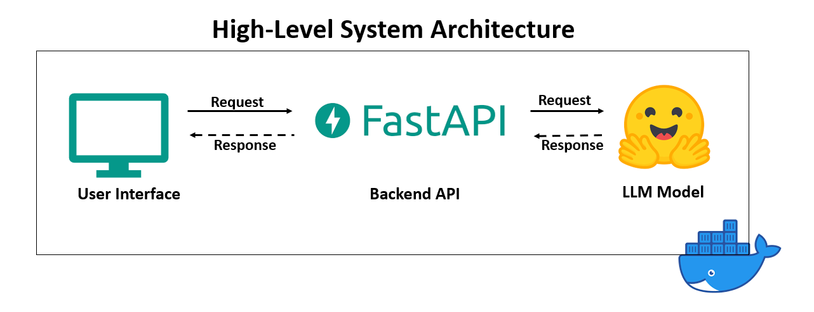
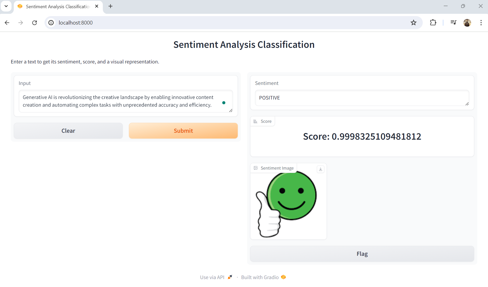
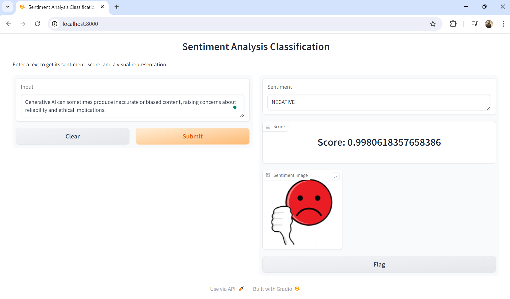

# Sentiment Analysis Using Large Language Models (LLM)

This project aims to develop an advanced sentiment analysis application leveraging the power of Large Language Models (LLM). The core objective is to analyze and interpret the sentiment of textual data, providing insights into whether the sentiment is positive, negative, or neutral. The project integrates various state-of-the-art technologies to ensure robust, efficient, and scalable performance.

## Technologies Used
    - Gradio: For creating a user-friendly web interface.
    - FastAPI: For building the backend API.
    - Hugging Face: For accessing pre-trained models.
    - Transformers: For model implementation.
    - Torch: For deep learning framework support.
    - TensorFlow: For additional machine learning model support.
    - FastAPI: For creating the API endpoints.
    - Uvicorn[standard]: For serving the FastAPI application.
    - tf-keras: For deep learning model training and evaluation.
    - Requests: For making HTTP requests within the application.
    - Docker: For containerizing the application.

## Project Implementation
    1. Data Ingestion: The system takes user input through a Gradio interface. This input is then sent to the FastAPI backend for processing.

    2. Model Processing: The input text is processed using Hugging Face's Transformers library, leveraging pre-trained LLM models. The models are supported by both Torch and TensorFlow frameworks, ensuring compatibility and performance optimization.

    3. Sentiment Analysis: The processed text is analyzed to determine the sentiment. The LLM models classify the sentiment into positive, negative, or neutral categories.

    4. Response Generation: The sentiment analysis results are sent back to the FastAPI backend, which then forwards the response to the Gradio interface, displaying the results to the user.

## Docker Integration
    1. Dockerfile: A Dockerfile is used to create a Docker image, encapsulating all the dependencies and configurations required for the application. This ensures consistency across different environments.
    
    2. .dockerignore: A .dockerignore file is used to exclude unnecessary files from the Docker image, reducing its size and improving build efficiency.
    
    3. Docker Image: The Docker image is built and successfully running, with the container serving the end-to-end functionality of the sentiment analysis application.

## Steps to run the project in local
1: python -m venv fastapi-env
    Win: fastapi-env\Scripts\activate
    Mac/Linux : source fastapi-env/bin/activate
2: pip install -r requirements.txt
3: To test api.py : uvicorn api:app --reload
4: docker build -t sentiment-app .
        to remove the container: docker rm 944ad6e81d3d
5: docker run -it -p 8000:8000 --name sentiment-hf sentiment-app

## Application demo screenshots

[Github](image.png)
[Linkedin](image.png)